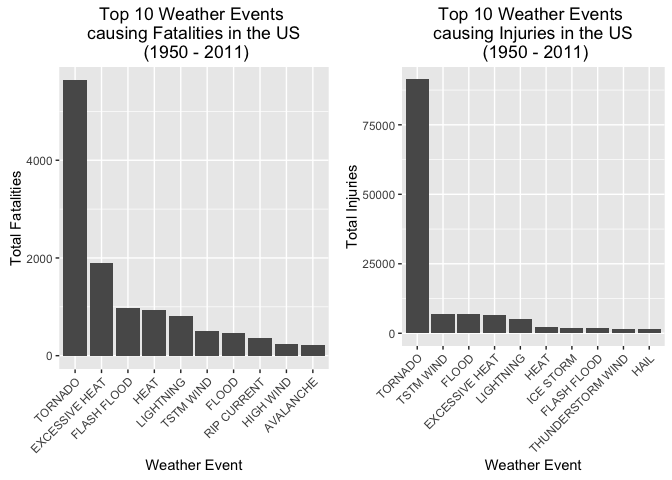
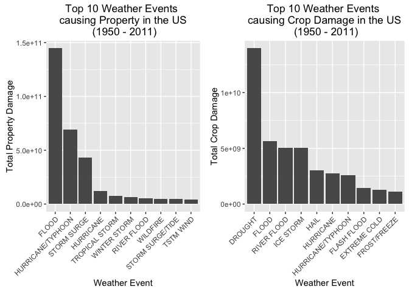
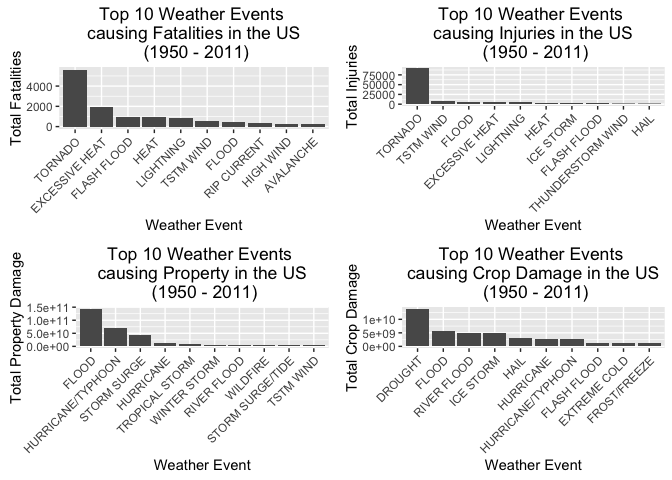

Analysis of the U.S. National Oceanic and Atmospheric Administration's (NOAA) storm database
============================================================================================

Synopsis
========

This report explores and analyses the U.S. National Oceanic and
Atmospheric Administration's (NOAA) storm database. In this database,
several details related to weather events and major storms in the Unites
States are recorded.

The analysis in this report investigated the types of events that are
most harmful with respect to population health. As well as, determining
which types of events have the greatest economic consequences.

The analysis concluded that Tornado, Excessive Heat and TSTM Wind are
among the top harmful with respect to population health. In addition, it
reports that Flood, Drought, and Hurricane/Typhoon have the greatest
economic consequences across the U.S.

Data Processing
===============

### Loading libraries

    library(R.utils)
    library(dplyr)
    library(ggplot2)
    library(gridExtra)

### Download and unzip the database in the chosen working directory

    setwd("~/Downloads/All DS Course/DS_Workspace/Reproducible Research_Course Project 2") # set working directory

    if (!file.exists('StormData.csv.bz2')) { # Download the file if it does not
        download.file( # exist in the working directory
            "http://d396qusza40orc.cloudfront.net/repdata%2Fdata%2FStormData.csv.bz2", destfile = 'StormData.csv.bz2')
    }

    if (file.exists('StormData.csv.bz2')) {
        # uncompress the file and read the CSV file into a data file
        dt <- read.csv(bzfile('StormData.csv.bz2'), header = TRUE)
    }

### Exploring variables and dimension of the dataset

    str(dt)

    ## 'data.frame':    902297 obs. of  37 variables:
    ##  $ STATE__   : num  1 1 1 1 1 1 1 1 1 1 ...
    ##  $ BGN_DATE  : Factor w/ 16335 levels "1/1/1966 0:00:00",..: 6523 6523 4242 11116 2224 2224 2260 383 3980 3980 ...
    ##  $ BGN_TIME  : Factor w/ 3608 levels "00:00:00 AM",..: 272 287 2705 1683 2584 3186 242 1683 3186 3186 ...
    ##  $ TIME_ZONE : Factor w/ 22 levels "ADT","AKS","AST",..: 7 7 7 7 7 7 7 7 7 7 ...
    ##  $ COUNTY    : num  97 3 57 89 43 77 9 123 125 57 ...
    ##  $ COUNTYNAME: Factor w/ 29601 levels "","5NM E OF MACKINAC BRIDGE TO PRESQUE ISLE LT MI",..: 13513 1873 4598 10592 4372 10094 1973 23873 24418 4598 ...
    ##  $ STATE     : Factor w/ 72 levels "AK","AL","AM",..: 2 2 2 2 2 2 2 2 2 2 ...
    ##  $ EVTYPE    : Factor w/ 985 levels "   HIGH SURF ADVISORY",..: 834 834 834 834 834 834 834 834 834 834 ...
    ##  $ BGN_RANGE : num  0 0 0 0 0 0 0 0 0 0 ...
    ##  $ BGN_AZI   : Factor w/ 35 levels "","  N"," NW",..: 1 1 1 1 1 1 1 1 1 1 ...
    ##  $ BGN_LOCATI: Factor w/ 54429 levels ""," Christiansburg",..: 1 1 1 1 1 1 1 1 1 1 ...
    ##  $ END_DATE  : Factor w/ 6663 levels "","1/1/1993 0:00:00",..: 1 1 1 1 1 1 1 1 1 1 ...
    ##  $ END_TIME  : Factor w/ 3647 levels ""," 0900CST",..: 1 1 1 1 1 1 1 1 1 1 ...
    ##  $ COUNTY_END: num  0 0 0 0 0 0 0 0 0 0 ...
    ##  $ COUNTYENDN: logi  NA NA NA NA NA NA ...
    ##  $ END_RANGE : num  0 0 0 0 0 0 0 0 0 0 ...
    ##  $ END_AZI   : Factor w/ 24 levels "","E","ENE","ESE",..: 1 1 1 1 1 1 1 1 1 1 ...
    ##  $ END_LOCATI: Factor w/ 34506 levels ""," CANTON"," TULIA",..: 1 1 1 1 1 1 1 1 1 1 ...
    ##  $ LENGTH    : num  14 2 0.1 0 0 1.5 1.5 0 3.3 2.3 ...
    ##  $ WIDTH     : num  100 150 123 100 150 177 33 33 100 100 ...
    ##  $ F         : int  3 2 2 2 2 2 2 1 3 3 ...
    ##  $ MAG       : num  0 0 0 0 0 0 0 0 0 0 ...
    ##  $ FATALITIES: num  0 0 0 0 0 0 0 0 1 0 ...
    ##  $ INJURIES  : num  15 0 2 2 2 6 1 0 14 0 ...
    ##  $ PROPDMG   : num  25 2.5 25 2.5 2.5 2.5 2.5 2.5 25 25 ...
    ##  $ PROPDMGEXP: Factor w/ 19 levels "","-","?","+",..: 17 17 17 17 17 17 17 17 17 17 ...
    ##  $ CROPDMG   : num  0 0 0 0 0 0 0 0 0 0 ...
    ##  $ CROPDMGEXP: Factor w/ 9 levels "","?","0","2",..: 1 1 1 1 1 1 1 1 1 1 ...
    ##  $ WFO       : Factor w/ 542 levels ""," CI","%SD",..: 1 1 1 1 1 1 1 1 1 1 ...
    ##  $ STATEOFFIC: Factor w/ 250 levels "","ALABAMA, Central",..: 1 1 1 1 1 1 1 1 1 1 ...
    ##  $ ZONENAMES : Factor w/ 25112 levels "","                                                                                                                               "| __truncated__,..: 1 1 1 1 1 1 1 1 1 1 ...
    ##  $ LATITUDE  : num  3040 3042 3340 3458 3412 ...
    ##  $ LONGITUDE : num  8812 8755 8742 8626 8642 ...
    ##  $ LATITUDE_E: num  3051 0 0 0 0 ...
    ##  $ LONGITUDE_: num  8806 0 0 0 0 ...
    ##  $ REMARKS   : Factor w/ 436781 levels "","\t","\t\t",..: 1 1 1 1 1 1 1 1 1 1 ...
    ##  $ REFNUM    : num  1 2 3 4 5 6 7 8 9 10 ...

    head(dt)

    ##   STATE__           BGN_DATE BGN_TIME TIME_ZONE COUNTY COUNTYNAME STATE
    ## 1       1  4/18/1950 0:00:00     0130       CST     97     MOBILE    AL
    ## 2       1  4/18/1950 0:00:00     0145       CST      3    BALDWIN    AL
    ## 3       1  2/20/1951 0:00:00     1600       CST     57    FAYETTE    AL
    ## 4       1   6/8/1951 0:00:00     0900       CST     89    MADISON    AL
    ## 5       1 11/15/1951 0:00:00     1500       CST     43    CULLMAN    AL
    ## 6       1 11/15/1951 0:00:00     2000       CST     77 LAUDERDALE    AL
    ##    EVTYPE BGN_RANGE BGN_AZI BGN_LOCATI END_DATE END_TIME COUNTY_END
    ## 1 TORNADO         0                                               0
    ## 2 TORNADO         0                                               0
    ## 3 TORNADO         0                                               0
    ## 4 TORNADO         0                                               0
    ## 5 TORNADO         0                                               0
    ## 6 TORNADO         0                                               0
    ##   COUNTYENDN END_RANGE END_AZI END_LOCATI LENGTH WIDTH F MAG FATALITIES
    ## 1         NA         0                      14.0   100 3   0          0
    ## 2         NA         0                       2.0   150 2   0          0
    ## 3         NA         0                       0.1   123 2   0          0
    ## 4         NA         0                       0.0   100 2   0          0
    ## 5         NA         0                       0.0   150 2   0          0
    ## 6         NA         0                       1.5   177 2   0          0
    ##   INJURIES PROPDMG PROPDMGEXP CROPDMG CROPDMGEXP WFO STATEOFFIC ZONENAMES
    ## 1       15    25.0          K       0                                    
    ## 2        0     2.5          K       0                                    
    ## 3        2    25.0          K       0                                    
    ## 4        2     2.5          K       0                                    
    ## 5        2     2.5          K       0                                    
    ## 6        6     2.5          K       0                                    
    ##   LATITUDE LONGITUDE LATITUDE_E LONGITUDE_ REMARKS REFNUM
    ## 1     3040      8812       3051       8806              1
    ## 2     3042      8755          0          0              2
    ## 3     3340      8742          0          0              3
    ## 4     3458      8626          0          0              4
    ## 5     3412      8642          0          0              5
    ## 6     3450      8748          0          0              6

Since this report aims to provide an answer to:
-----------------------------------------------

1.  Which types of events are most harmful with respect to population
    health?
2.  which types of events have the greatest economic consequences?

### Therefore only relevant variables of the dataset were selected in order to increase the computation speed

    dt <-
        select(dt,
               EVTYPE,
               FATALITIES,
               INJURIES,
               PROPDMG,
               PROPDMGEXP,
               CROPDMG,
               CROPDMGEXP)

Harmful weather events to population health divided into:
---------------------------------------------------------

### 1. Top harmful events with respect to fatalities:

    top_fatalities <-
        # finds the sum of fatalities according to event type
        aggregate(dt$FATALITIES, list(dt$EVTYPE), FUN  = 'sum')
    top_fatalities <-
        arrange(top_fatalities, desc(x)) %>% top_n(10) # sort Desc.
    top_fatalities # list top 10 events causing fatalities

    ##           Group.1    x
    ## 1         TORNADO 5633
    ## 2  EXCESSIVE HEAT 1903
    ## 3     FLASH FLOOD  978
    ## 4            HEAT  937
    ## 5       LIGHTNING  816
    ## 6       TSTM WIND  504
    ## 7           FLOOD  470
    ## 8     RIP CURRENT  368
    ## 9       HIGH WIND  248
    ## 10      AVALANCHE  224

### 2. Top harmful events ll respect to injuries:

    top_injuries <- aggregate(dt$INJURIES, list(dt$EVTYPE), FUN  = 'sum')
    top_injuries <- arrange(top_injuries, desc(x)) %>% top_n(10)
    top_injuries

    ##              Group.1     x
    ## 1            TORNADO 91346
    ## 2          TSTM WIND  6957
    ## 3              FLOOD  6789
    ## 4     EXCESSIVE HEAT  6525
    ## 5          LIGHTNING  5230
    ## 6               HEAT  2100
    ## 7          ICE STORM  1975
    ## 8        FLASH FLOOD  1777
    ## 9  THUNDERSTORM WIND  1488
    ## 10              HAIL  1361

A Barplot for top events causing Fatalities and Injuries
--------------------------------------------------------

    fatalities_barplot <- 
        ggplot(top_fatalities, aes(x = reorder(Group.1,-x), y = x))  +
        geom_bar(stat = 'identity') +
        scale_y_continuous('Total Fatalities') + 
        theme(axis.text.x = element_text(angle = 45, hjust = 1)) + 
        xlab('Weather Event') + 
        ggtitle('Top 10 Weather Events \n causing Fatalities in the US \n (1950 - 2011)')

    injuries_barplot <-
        ggplot(top_injuries, aes(x = reorder(Group.1, -x), y = x))  +
        geom_bar(stat = 'identity') + 
        scale_y_continuous('Total Injuries') + 
        theme(axis.text.x = element_text(angle = 45, hjust = 1)) + 
        xlab('Weather Event') + 
        ggtitle('Top 10 Weather Events \n causing Injuries in the US \n (1950 - 2011)')

    grid.arrange(fatalities_barplot, injuries_barplot, ncol = 2)

Events that have the greatest economic consequences divided into:
-----------------------------------------------------------------

### Implementation of function that does the calcualtion of the 'damage' value and its expoential. This is in order to calculate both 'Property Damage' and 'Crop Damage'

    ## This function takes as input: database, exponential number. Outputs: the
    ## value of 'Damage' mutliplied by its exponential.

    exponential_to_number <- function(data = dt, exponential, output) {
        
        index <- # finds index of the selected exponential
            which(colnames(data) == exponential)
        
        data[, index] <- # Turns that column into char.
            as.character(data[, index])
        
        # check for NA values and also turns the chosen column to upperCase
        non_na_values <- !is.na(toupper(data[, index]))
        
        data[is.na(data[, index]), index] <- '0' # Turn NA values to 0
        
        # The following lines checks of the observation is non NA value and its
        # upper/lower case equals the specified character factors ('', 'h', 'k',
        # 'm', 'b') then turns its value to ('0', '2', '3', '6', '9') 
        # respectively.
        data[non_na_values & toupper(data[, index]) == '', index]  <- '0'
        data[non_na_values & toupper(data[, index]) == 'H', index] <- '2'
        data[non_na_values & toupper(data[, index]) == 'K', index] <- '3'
        data[non_na_values & toupper(data[, index]) == 'M', index] <- '6'
        data[non_na_values & toupper(data[, index]) == 'B', index] <- '9'
        
        data[, index] <-
            as.numeric(data[, index]) # Turn char numbers into numeric
        
        # vector to store the multiplication of exponential * magnitude
        result <- 10 ^ data[, index] * data[, index - 1]
        data <-
            cbind(data, result) # Bind the newly calculated vector to dataset
        names(data)[ncol(data)] <- output # set the new column name
        
        return(data)
    }

### 1. Top harmful events with respect to Property Damage:

    dt <- exponential_to_number(dt, 'PROPDMGEXP', 'property_damage')
    top_property_damage <- # finds the sum of PROPDMG according to event type
        aggregate(dt$property_damage, list(dt$EVTYPE), FUN  = 'sum')
    top_property_damage <- # Sort the vector descendingly
        arrange(top_property_damage, desc(x)) %>% top_n(10)
    top_property_damage # list top 10 events causing Property Damage

    ##              Group.1            x
    ## 1              FLOOD 144657709807
    ## 2  HURRICANE/TYPHOON  69305840000
    ## 3        STORM SURGE  43323536000
    ## 4          HURRICANE  11868319010
    ## 5     TROPICAL STORM   7703890550
    ## 6       WINTER STORM   6688497251
    ## 7        RIVER FLOOD   5118945500
    ## 8           WILDFIRE   4765114000
    ## 9   STORM SURGE/TIDE   4641188000
    ## 10         TSTM WIND   4484928495

### 2. Top harmful events with respect to Crop Damage:

    dt <- exponential_to_number(dt, 'CROPDMGEXP', 'crop_damage')
    top_crop_damage <-
        aggregate(dt$crop_damage, list(dt$EVTYPE), FUN  = 'sum')
    top_crop_damage <- arrange(top_crop_damage, desc(x)) %>% top_n(10)
    top_crop_damage

    ##              Group.1           x
    ## 1            DROUGHT 13972566000
    ## 2              FLOOD  5661968450
    ## 3        RIVER FLOOD  5029459000
    ## 4          ICE STORM  5022113500
    ## 5               HAIL  3025954473
    ## 6          HURRICANE  2741910000
    ## 7  HURRICANE/TYPHOON  2607872800
    ## 8        FLASH FLOOD  1421317100
    ## 9       EXTREME COLD  1292973000
    ## 10      FROST/FREEZE  1094086000

A Barplot for top events causing Property and Crop Damage
---------------------------------------------------------

    property_barplot <-
            ggplot(top_property_damage, aes(x = reorder(Group.1, -x), y = x))  +         geom_bar(stat = 'identity') +
            scale_y_continuous('Total Property Damage') + 
            theme(axis.text.x = element_text(angle = 45, hjust = 1)) +                   xlab('Weather Event') + 
            ggtitle('Top 10 Weather Events \n causing Property in the US \n (1950 - 2011)')
        
    crop_barplot <-
            ggplot(top_crop_damage, aes(x = reorder(Group.1, -x), y = x))  +             geom_bar(stat = 'identity') + 
            scale_y_continuous('Total Crop Damage') + 
            theme(axis.text.x = element_text(angle = 45, hjust = 1)) +
            xlab('Weather Event') + 
            ggtitle('Top 10 Weather Events \n causing Crop Damage in the US \n (1950 - 2011)')
        
        grid.arrange(property_barplot, crop_barplot, ncol = 2)

Results
=======

Data analysis and exploration were performed on the U.S. National
Oceanic and Atmospheric Administration's (NOAA) storm database. This
database tracks characteristics of weather events in the United States,
as well as estimates of any fatalities, injuries, and property damage

It was found that Tornado was the top factor for causing fatalities,
followed by Excessive Heat and Flash Flood. Tornado was also the top
factor for casuing injuries, followed by TSTM Wind and Flood.

In addition, Flood was also the top factor for causing Property Damage,
followed by Hurricane/ Typhoon and Storm Surge. However, Drought was the
top factor causing crop damage, followed by Flood and River Flood.

    ## Summary of the previous plots plotted on one figure

    fatalities_barplot <-
        ggplot(top_fatalities, aes(x = reorder(Group.1,-x), y = x))  +
        geom_bar(stat = 'identity') +
        scale_y_continuous('Total Fatalities') +
        theme(axis.text.x = element_text(angle = 45, hjust = 1)) +
        xlab('Weather Event') +
        ggtitle('Top 10 Weather Events \n causing Fatalities in the US \n (1950 - 2011)')
        
        injuries_barplot <-
        ggplot(top_injuries, aes(x = reorder(Group.1, -x), y = x))  +
        geom_bar(stat = 'identity') +
        scale_y_continuous('Total Injuries') +
        theme(axis.text.x = element_text(angle = 45, hjust = 1)) +
        xlab('Weather Event') +
        ggtitle('Top 10 Weather Events \n causing Injuries in the US \n (1950 - 2011)')
        
        property_barplot <-
        ggplot(top_property_damage, aes(x = reorder(Group.1, -x), y = x))  +         geom_bar(stat = 'identity') +
        scale_y_continuous('Total Property Damage') +
        theme(axis.text.x = element_text(angle = 45, hjust = 1)) +                   xlab('Weather Event') +
        ggtitle('Top 10 Weather Events \n causing Property in the US \n (1950 - 2011)')
        
        crop_barplot <-
        ggplot(top_crop_damage, aes(x = reorder(Group.1, -x), y = x))  +             geom_bar(stat = 'identity') +
        scale_y_continuous('Total Crop Damage') +
        theme(axis.text.x = element_text(angle = 45, hjust = 1)) +
        xlab('Weather Event') +
        ggtitle('Top 10 Weather Events \n causing Crop Damage in the US \n (1950 - 2011)')
        
        grid.arrange(
        fatalities_barplot,
        injuries_barplot,
        property_barplot,
        crop_barplot,
        nrow = 2,
        ncol = 2
        )

